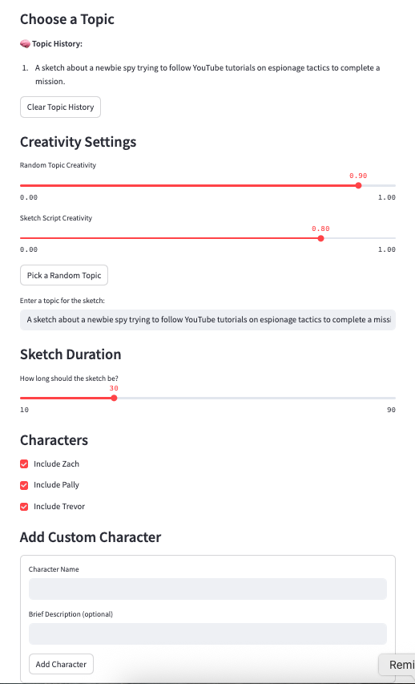
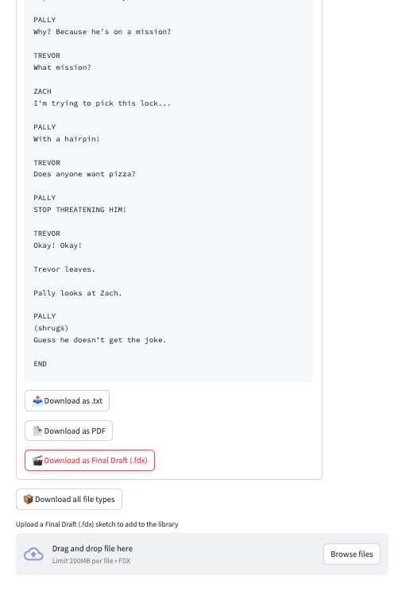

# Vertical-Video-Comedy-Sketch--.fdx-pdf_generator-

**An AI-powered app that writes and formats comedy sketches for TikTok, Instagram Reels, and YouTube Shorts in screenplay style.**

---

## 🎭 Overview

This Streamlit application generates short, punchy comedy sketches formatted like professional screenplays. It allows users to customize characters, input a topic or generate a random one, and select sketch duration. Once generated, sketches can be exported as `.txt`, `.pdf`, and `.fdx` (Final Draft) files with precise formatting that mimics industry standards.

---

## 🚀 Features

- ✍️ **AI-generated screenplays** tailored to vertical-video platforms
- 🎯 Control over **topic, duration, and characters**
- 🎬 Export to:
  - `.txt` (plain text)
  - `.pdf` (screenplay-formatted, readable)
  - `.fdx` (Final Draft industry-standard format)
- 🧠 **Topic history** and creative regeneration tools
- 🧑‍🤝‍🧑 Custom character creation
- 📁 Upload your own `.fdx` files and embed them into the reference library

---

## 📸 Screenshots

### Topic & Generation Panel


### Output & Export Panel


### Side-by-Side Exports (Text, PDF, Final Draft)


---

## 🧱 Requirements

Install the dependencies using:

```bash
pip install -r requirements.txt
