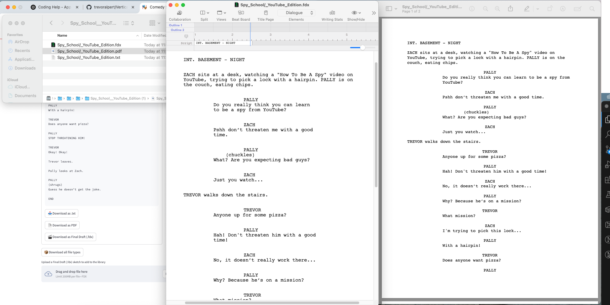

# Vertical-Video-Comedy-Sketch--.fdx-pdf_generator-

<p align="center">
  
</p>

<p align="center">
  <b>An AI-powered app that writes and formats comedy sketches for TikTok, Instagram Reels, and YouTube Shorts in screenplay style.</b>
</p>

<p align="center">
  <a href="https://www.python.org/"></a>
  <a href="https://streamlit.io/"></a>
  <a href="#license"></a>
</p>

---

## 🎭 Overview

**Vertical-Video-Comedy-Sketch--.fdx-pdf_generator-** is a Streamlit application that generates short, punchy comedy sketches formatted like professional screenplays. Designed for creators on TikTok, Instagram Reels, and YouTube Shorts, it lets you customize characters, input or randomize topics, and select sketch duration. Export your sketches as `.txt`, `.pdf`, or `.fdx` (Final Draft) files, all with industry-standard formatting.

---

## 🚀 Features

- **AI-generated screenplays** tailored for vertical-video platforms
- **Customizable topics, durations, and characters**
- **Export options:**
  - `.txt` (plain text)
  - `.pdf` (screenplay-formatted, readable)
  - `.fdx` (Final Draft industry-standard)
- **Topic history** and creative regeneration tools
- **Custom character creation**
- **Upload your own `.fdx` files** to enrich the reference library

---

## 🧱 Requirements

- Python 3.9+
- See `requirements.txt` for all dependencies

Install dependencies:

```bash
pip install -r requirements.txt
```

---

## 🚦 Getting Started

1. **Clone the repository:**
   ```bash
   git clone <repo-url>
   cd Vertical-Video-Comedy-Sketch--.fdx-pdf_generator-
   ```
2. **Install dependencies:**
   ```bash
   pip install -r requirements.txt
   ```
3. **Run the app:**
   ```bash
   streamlit run app.py
   ```

---

## 💡 Usage

- Select or randomize a topic for your sketch.
- Customize characters and set the desired duration.
- Click **Generate** to create your screenplay.
- Export your sketch as `.txt`, `.pdf`, or `.fdx`.
- Optionally, upload your own `.fdx` files to the reference library.

---

## 📸 Screenshots

### Topic & Generation Panel


### Output & Export Panel


### Side-by-Side Exports (Text, PDF, Final Draft)


---

## 🤝 Contributing

Contributions are welcome! Please open issues or submit pull requests for improvements, bug fixes, or new features.

---

## 📄 License

This project is licensed under the MIT License. See the [LICENSE](LICENSE) file for details.
